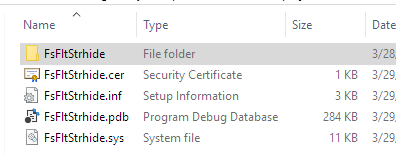

Disclaimer
===========
***Use at your own risk.***

As a proof of concept, this project installs a Windows driver that might possibly damage your system (particularly the filesystem). You are advised to deploy this in to a test machine (such as a VM). Also, at the time of writing I have not really looked into how to uninstall this thing--we're just trying to get a thing working.  
We do not make any warranties about the reliability of this driver. **Any action you take upon this source code is strictly at your own risk** and we will not be liable for any losses and damages in connection with the use of this project.

Description
============
A Windows filesystem minifilter driver [(more info: MSDN)](https://msdn.microsoft.com/library/windows/hardware/ff540402).  
While driver is loaded on a target system, _most_ read attempts from files with extension .!hid will return blank.

Verbose output to attached kernel debugger available (and enabled by default).

Background
===========
We were reverse engineering a driver until we realised something: RE might go smoother if we knew what a plain driver looked like.

Well the semester is about to end, but maybe someone in the future can continue to look into kernel debugging and reverse engineering for Windows!

Setup
======
Note: Instructions below refers to 'debug host' as the machine building and/or running the debugger;  
'debug target' refers to the machine with the driver installed and being debugged.

This driver targets Windows 10, Version 1703.  
Supposedly this means that this driver should work for future versions of Windows. Hopefully.

Why was this chosen? Because driver development for win10-1709 using VS2017 is not working right now (can personally confirm).

Prerequisites
--------------
Prerequisites setup below is basically copied from here:  
https://docs.microsoft.com/en-us/windows-hardware/drivers/other-wdk-downloads  
(just in case of link rot) <!-- like many MSDN links -->

- Visual Studio 2015
	- Available at  
		https://www.visualstudio.com/vs/older-downloads/  
		_Requires a Microsoft account._
- Windows 10, Version 1703 (10.0.15063) SDK
	- Available at  
		https://developer.microsoft.com/en-us/windows/downloads/sdk-archive
	- Direct links: 
		[[EXE]](https://go.microsoft.com/fwlink/p/?LinkId=845298) 
		[[ISO]](https://go.microsoft.com/fwlink/p/?LinkId=845299)
- Windows 10.0.15063 WDK (Windows Driver Kit)
	- .EXE web downloader available at  
		https://go.microsoft.com/fwlink/p/?LinkID=845980

Deployment Instructions
------------------------
### Automatic Provisioning
Using Visual Studio to deploy modified drivers should simplify testing code changes.

However, this process does not work 100% of the time (from what I observe). You may need to set the debug target to test mode to manually complete driver installation at the end of these instructions.

(Below instructions are simplified; view full instructions at  
https://docs.microsoft.com/en-us/windows-hardware/drivers/gettingstarted/provision-a-target-computer-wdk-8-1 )

#### First-Time Setup
> Note: This setup process will reboot the debug target a couple of times and configure the machine to auto-logon as a new debug user.

1. On the debug host, locate the WDK Test Target Setup MSI matching the platform of the target host. This MSI can be found in the WDK installation directory under '\\Remote\\', e.g.:  
	%ProgramFiles(x86)%\\Windows Kits\\10\\Remote\\x64\\WDK Test Target Setup x64-x64_en-us.msi
2. Copy this MSI to and install on the debug target.
3. On the debug host, through the Visual Studio menu bar, select 'Driver&nbsp;> Test&nbsp;> Configure Devices...'.
4. Click 'Add new device' and set up desired debug configuration.

#### Repeated Steps (on reboot)
_This is probably totally scriptable._

5. When the provisioning process is complete,  
	the boot configuration may need to be edited to allow for manual driver installation.  
	Unfortunately, this step may have to be repeated whenever the debug target is power cycled:
	
	<!--DUPL:EnableWinTestMode-->
	_As an administrator,_ run the following commands:
	```
	bcdedit.exe /set nointegritychecks off
	bcdedit.exe /set testsigning on

	:: Also enable kernel debugging to specify debug output
	:: (use same debug settings as provisioning config):
	:: Example commands if kernel debugging over ethernet
	SET HostIP=1.2.3.4
	SET Port=12321
	bcdedit.exe /debug on
	bcdedit.exe /dbgsettings net hostip:%HostIP% port:%Port%
	```

#### Repeated Steps: Driver Deployment
_For whenever changes are made to the driver._

6. On the debug host, in the Visual Studio menu bar,  
	build the driver via 'Build&nbsp;> Build FsFltStrhide'.
7. Deploy the driver via 'Build&nbsp;> Deploy FsFltStrhide'.
8. On the debug target, navigate to 'C:\\DriverTest\\Drivers\\'  
	and install the driver via right-clicking the .inf file and selecting 'Install'.
9. Load the driver by opening an _adminstrative_ command prompt and entering command:  
	`fltmc load FsFltStrhide`

### Manual
It is generally recommended to use automatic provisioning (since it handles driver uninstallation and installs debugging symbols), but some situations may prevent you from doing so.

To observe kernel debug output from this driver, you may wish to enable kernel debugging on the debug target to connect to it.

1. Build Visual Studio project.  
	This produces a few files to .zip up and transfer to the debug target:  
	
1. On the debug target, we will disable signed driver enforcement. This a security feature since Windows Vista(ish?) to help defend against rootkits. Much like what we're installing right now.  
	Not disabling this will have Windows blocking either installation of the driver or its startup.  
	&#8203;<!--DUPL:EnableWinTestMode-->
	_As an administrator,_ run the following commands:
	```
	bcdedit.exe /set nointegritychecks off
	bcdedit.exe /set testsigning on
	```
1. Reboot the debug target. Windows should permit the installation of any driver for this session.
1. Navigate to the location on the debug target where you copied the build output files.  
	Right-click the setup information file 'FsFltStrhide.inf' and select 'Install'.
1. Enjoy while hot.
